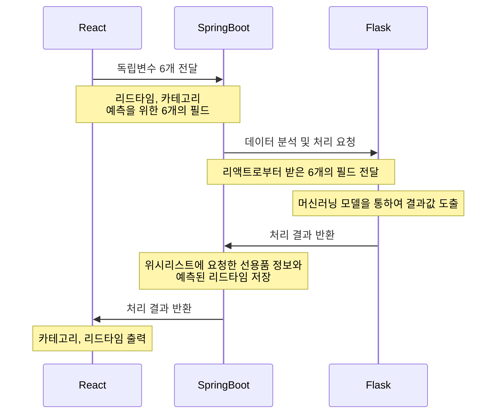
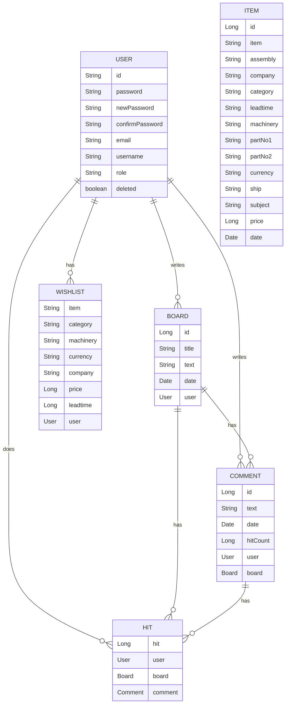

# 선용품 구매시기 분석 및 예측 웹 서비스
> 선용품의 구매시기를 분석하고 예측하는 웹 애플리케이션

배포 주소 :  http://43.200.163.145:3000

<br />

## ✅ 개요
### 프로그램 개발 목적과 배경
- 선박이 항만에 입항할 때 선박에 실리는 선용품들은 입항 기간 내에 공급돼야 한다.
- 각 선용품 발주 후 제조 기간과 운송 기간 등의 변수에 따라 입고될 때까지의 리드타임이 상이하다. 
- 선용품을 적절한 시기에 발주하지 못하면 보관비용이 발생한다.
- 선박 관리 비용을 절감하기 위해 선용품별 리드타임을 예측하여 최적의 발주 계획을 수립하는 것이 필요하다.
- 따라서 본 프로젝트에서는 ㈜마린소프트에서 제공하는 데이터를 기반으로 머신러닝, 딥러닝 모델을 개발하여 웹 서비스를 제공한다.

<br />

## ✅ 기능
- 사용자는 딥러닝 모델을 활용하여 선용품의 카테고리를 예측할 수 있습니다.
- 사용자는 머신러닝 모델을 활용하여 선용품의 리드타임을 예측할 수 있습니다.
- 사용자는 선용품을 검색할 수 있으며, 원하는 선용품을 위시리스트에 담을 수 있습니다.
- 각 사용자는 개인 계정을 가지며, 위시리스트를 통해 선용품의 정보를 관리할 수 있습니다.
- 사용자는 게시판을 이용하여 게시글과 댓글을 CRUD할 수 있습니다.
- 사용자는 댓글에 좋아요를 남길 수 있습니다.

<br />

## ✅ 시작하기
### 사전요구 사항
> Back-End
 - Java JDK 11 버전이 설치되어 있어야 합니다.
 - 스프링 프레임워크 5.3.20 버전을 사용합니다.
 - 스프링 부트 2.7.11 버전을 사용합니다
 - MySQL 서버와 MySQL Workbench가 설치되어 있어야 합니다.

> Front-End
 - Node.js가 설치되어 있어야 합니다
 - 리액트 프레임워크 버전은 프로젝트에 따라 다를 수 있으며, 이에 따라 필요한 모듈이 다를 수 있습니다.
 - 프로젝트에서 사용하는 외부 라이브러리에 따라 추가적인 사전 요구 사항이 있을 수 있습니다.

> Data Analysis
- 가상 환경 구성 후 필요한 라이브러리 설치 후 app.py를 실행합니다.
```javascript
$ .\venv\Scripts\activate
$ (venv) cd DA
$ (venv) pip install -r requirements.txt
$ (venv) python app.py
```

### 설치 및 실행
> 1. 깃허브에서 프로젝트를 클론합니다.
```javascript
git clone https://github.com/KHEN-ROE/ShipSupplies.git
```

> 2. 프론트엔드 디렉토리에서 필요한 패키지를 설치합니다.
```javascript
npm install
```

> 3. MySQL에서 ship 데이터베이스를 생성합니다. application.yml에서 username과 password를 개인 설정에 맞게 수정합니다.

<br />

## ✅ 역할

> BE
- API설계
- DB설계
- Interceptor 이용하여 사용자 인증
- Validation
- 예외처리
- Docker, AWS EC2 활용하여 배포

> FE
- React 이용하여 프론트엔드 개발
- tailwind CSS 적용

> DA
- 선용품의 카테고리를 예측하는 딥러닝 모델 개발
- 선용품의 리드타임을 예측하는 머신러닝 모델 개발

<br />

## ✅ 클래스 다이어그램

<br />

## ✅ ERD


<br />

## ✅ 사용된 기술
  - Frontend: React
  - Backend: Spring Boot, JPA
  - Database: MySQL
  - Data Analysis: tensorflow
  - Deployment: AWS, Docker

<br />

## ✅ 개발자 정보
 - Name : KEN
 - Email: shdnrnjs@gmail.com
 - Github : http://github.com/KHEN-ROE

<br />
 
 ## ✅ 기여방법
  - 버그나 기능 개선 제안은 이슈로 등록해주세요.
